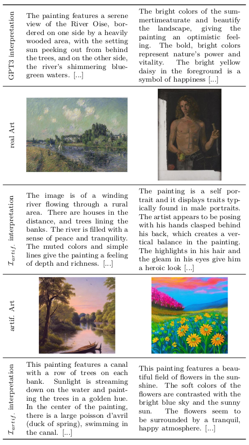

# ArtInterpretation-Supplementary
Contains supplementary material for our accepted submission titled "Interpreting Art by Leveraging Pre-Trained Models" to the MVA2023.
The goal was to leverage pre-trained foundation models to first generate data and then learn to interpret artworks.
Here are some examples:

The supplementary here includes four directories each containing 250 generated images and interpretations respectively.
These are generated iteratively by alternating a latent diffusion model together with our best-performing interpretation model.
Each of these directories corresponds to one of the example images from the paper.
The relevant paragraph in the paper is:

> ... Furthermore, we examined alternating cycles of interpretation and art generation using the LDM specified above and  [the interpretation model trained on the artificial split]. We observe no convergence to one specific art style or subject. The interpretations often focus on specific image parts, which then feature more prominently in the next generated image. After a while, this seems to lead to a switch in focus, which is highly related to the art style itself.

## GPT3 Prompt Design
We follow OpenAIs suggestions and lead our prompt with a clear expectation of the intended output before giving two example outputs in the form "Q: What is a possible interpretation of {painting} by {artist}?".

The complete prompt is
> I am a skilled art historian. If you give me a painting, I will give you a possible interpretation.
> Q: What is a possible interpretation of "Starry Night", by Vincent van Gogh?
> A: The overwhelming night sky, takes up most of the background. Its swirling, flowing lines appear to be swishing across the background in this gentle, wavy motion and seem to be merging at the center to form this spiral-like formation. Eleven fiery yellow stars that look like huge fireballs illuminate this whole piece and contrast with the cool blue. The painting seems to be seething with life as the fluid brushstrokes give the impression of movement. The artist painted a cypress bush in a very prominent position. A possible interpretation could be that the bush was a representation of the inner anguish he was going through at that time.
> Q: What is a possible interpretation of "Abstract Painting Blue 1953 1" by Ad Reinhardt?
> A: Perception is a function of rods and cones adjusting in the retina. Waking in the middle of the night, everything is black at first and only slowly more colors begin to emerge. It takes patience and acute attention to make sense of the new reality. The artists use of color is so subtle that it is on the very threshold of perception. The somber monochrome rewards the patient viewer with a site of peaceful contemplation.   
> Q: What is a possible interpretation of "{painting}" by {artist}?
> A:

